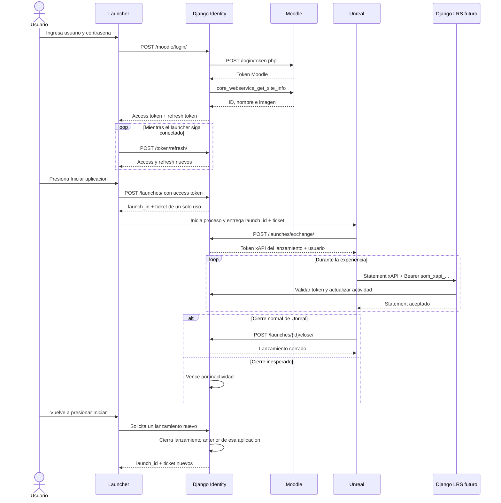

# Arquitectura de sesion entre Launcher, Unreal y SOM

## Diagrama principal

## Credenciales y duraciones

| Credencial | Prefijo | Valor predeterminado | Quien la conserva |
|---|---|---:|---|
| Acceso del launcher | `som_la_` | 15 minutos | Launcher |
| Renovacion del launcher | `som_lr_` | 12 horas maximas | Almacen seguro del launcher |
| Ticket de lanzamiento | `som_lt_` | 60 segundos y un uso | Se transfiere a Unreal al iniciar |
| Acceso xAPI | `som_xapi_` | 1 hora inactivo, 8 horas maximo | Instancia de Unreal |

El refresh token rota en cada uso. Si se intenta reutilizar uno anterior,
Django considera comprometida la sesion y revoca el launcher y todos sus
lanzamientos.

El token xAPI tiene expiracion deslizante: cada solicitud autenticada actualiza
`last_activity_at`, pero nunca puede superar la duracion maxima absoluta. Un
heartbeat puede mantener activa una experiencia que permanece mucho tiempo sin
producir statements.

## Cierre y reapertura

- Cerrar Unreal no cierra automaticamente el launcher.
- Un cierre normal de Unreal revoca solamente el lanzamiento correspondiente.
- Si Unreal se cae, su token vence por inactividad.
- Cada nuevo clic en `Iniciar` crea otro `launch_id` y otro token xAPI.
- Al crear un lanzamiento para la misma aplicacion y sesion, el anterior se
  marca como reemplazado y deja de autenticar inmediatamente.
- Cerrar sesion en el launcher revoca access tokens, refresh tokens y todas las
  experiencias abiertas.

Si Unreal pierde conectividad debe conservar localmente los statements con sus
UUID y timestamps originales. Cuando recupere comunicacion puede reenviarlos
solo mientras su token siga activo; si ya vencio, se requiere iniciar una nueva
experiencia desde el launcher.
